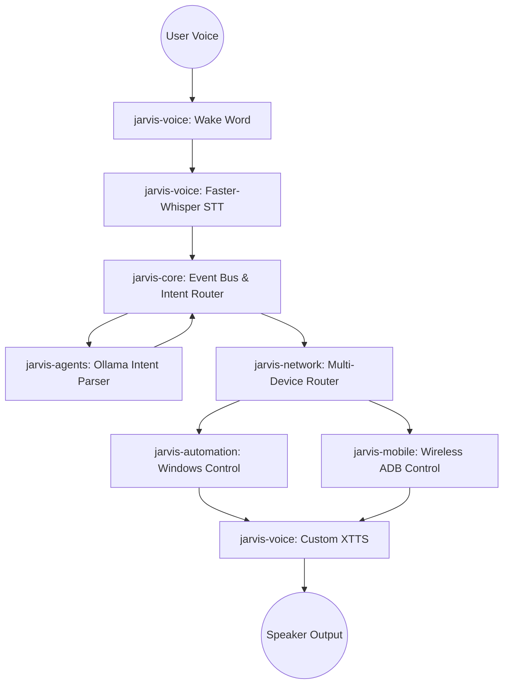

# JARVIS AI Multi-Device Assistant - Implementation Plan

This document outlines the architecture, components, and implementation strategy for the JARVIS multi-device AI assistant.

## Goal Description
Build a real-time, highly modular, local-first AI assistant capable of voice interaction, wake word detection, intent understanding using local LLMs (Ollama), and wireless multi-device automation (Android and Windows). The system will integrate a custom-trained XTTS/Coqui voice model and be structured into reusable packages.

## User Review Required
> [!IMPORTANT]
> - **Wake Word Engine**: I plan to use `openwakeword` for local wake word detection ("Hey Jarvis"). Please confirm if this is acceptable or if you have a preferred engine.
> - **ADB Dependency**: Wireless Android control requires ADB to be installed and devices to be paired over WiFi. You will need to pair the devices initially.
> - **Model Directory**: I found your trained XTTS models in `k:\PROJECTS\Phone agent\Jarvis_TTS\output\`. I will dynamically pick the latest run, or we can configure a specific path.
> - **Project Location**: I will create the project inside `k:\PROJECTS\Phone agent\JarvisAssistant`. Let me know if you prefer a different location.

## Open Questions
> [!WARNING]
> - **Ollama Integration**: Do you currently have Ollama installed and running on your Windows machine?
> - **Android App vs ADB**: For Android, I will use Wireless ADB to launch apps and send text. This doesn't require a custom Android App but relies on ADB commands. Does this fit your vision, or did you want a dedicated companion APK?

## Proposed Architecture

The system will be built using a modular Python architecture.

### Modules Structure
- `jarvis-core/`: Core event bus, configurations, and application lifecycle.
- `jarvis-voice/`: Wake word detection, STT (Faster Whisper), and your custom XTTS TTS. Designed as an independent reusable package.
- `jarvis-automation/`: Windows desktop automation (opening apps, system controls).
- `jarvis-mobile/`: Android control via Wireless ADB (app launching, tapping, text input).
- `jarvis-network/`: Device registry, routing commands between "laptop", "phone", "tablet".
- `jarvis-agents/`: LLM integration (Ollama) to parse natural language into structured JSON commands.
- `jarvis-memory/`: Context and history management.

### Component Details

#### [NEW] `jarvis-core/`
- `config.py`: Global configuration loading.
- `event_bus.py`: Async PubSub system to decouple modules.

#### [NEW] `jarvis-voice/`
- `wake_word.py`: Microphone stream listener detecting "Hey Jarvis".
- `stt.py`: Faster-Whisper integration.
- `tts.py`: Coqui TTS integration dynamically loading the custom XTTS model.

#### [NEW] `jarvis-mobile/`
- `adb_manager.py`: Connect to devices over WiFi, manage device states.
- `android_controller.py`: Launch apps (`am start`), inject text (`input text`), tap screen (`input tap`).

#### [NEW] `jarvis-automation/`
- `windows_controller.py`: Open apps using `os.startfile` or `subprocess`, send keys.

#### [NEW] `jarvis-agents/`
- `intent_parser.py`: Connect to Ollama (Llama 3) to convert "open WhatsApp on phone" into `{"action": "open_app", "app": "whatsapp", "target": "phone"}`.

#### [NEW] `main.py`
- The entry point that initializes all modules and starts the event loop.

## Verification Plan

### Automated Tests
- Unit tests for the Intent Parser to ensure LLM outputs correct JSON.
- Unit tests for the TTS module to ensure it can load the XTTS model without crashing.

### Manual Verification
1. Run `main.py`.
2. Speak "Hey Jarvis" -> System acknowledges.
3. Speak "Open Calculator on laptop" -> Windows calculator opens.
4. Speak "Open YouTube on phone" -> ADB launches YouTube on the connected Android device.
5. Verify that all voice responses use your custom trained XTTS model.
